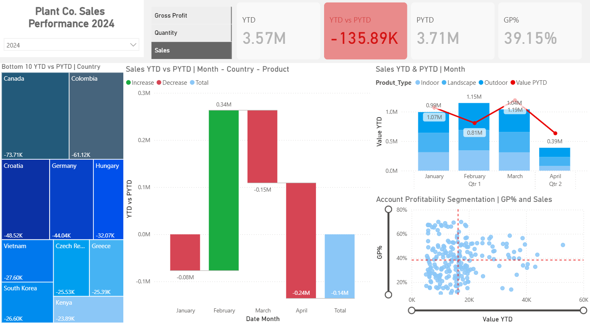

# 🚀 Power BI Portfolio Project – Sales Performance Dashboard

This repository showcases a complete, end-to-end **Sales Performance Dashboard** built in Power BI. It reflects best practices in data cleaning, modeling, DAX measures, and visualization.

## 📊 Dashboard Summary

The dashboard provides business stakeholders with a high-level and drillable view of sales performance across regions, customers, and products. The focus is on performance monitoring, insight generation, and actionable decision support.

### ✅ Features

- **KPI Overview**
  - Total Revenue
  - Total Profit
  - Profit Margin %
  - Number of Customers
- **Performance Breakdown**
  - Sales by Region and Country
  - Top & Bottom Performing Products
  - Customer Segments & Profitability
- **Time Intelligence**
  - Monthly Revenue Trends
  - Year-over-Year Performance
- **Interactive Filtering**
  - Dynamic slicers by Region, Product Category, Customer Segment, and Time
  - Drill-through capabilities for detailed views

## 🧩 Data Model

- Cleaned and transformed using **Power Query**
- Star schema with the following core tables:
  - `Sales`
  - `Customers`
  - `Products`
  - `Regions`
  - `Dates`
- Custom DAX measures for:
  - YoY Revenue
  - Profit Margin %
  - Rank-based visualizations
  - Cumulative totals

## 📁 Files Included

- Download the Power BI report: [Sales_Performance_Dashboard.pbix](Sales_Performance_Dashboard.pbix)

## 💻 How to View

1. Download and install [Power BI Desktop](https://powerbi.microsoft.com/desktop/).
2. Download or clone this repository.
3. Open the `.pbix` file in Power BI Desktop to explore the dashboard and data model.

## 🖼️ Dashboard Preview

```markdown
## 🖼️ Dashboard Preview



